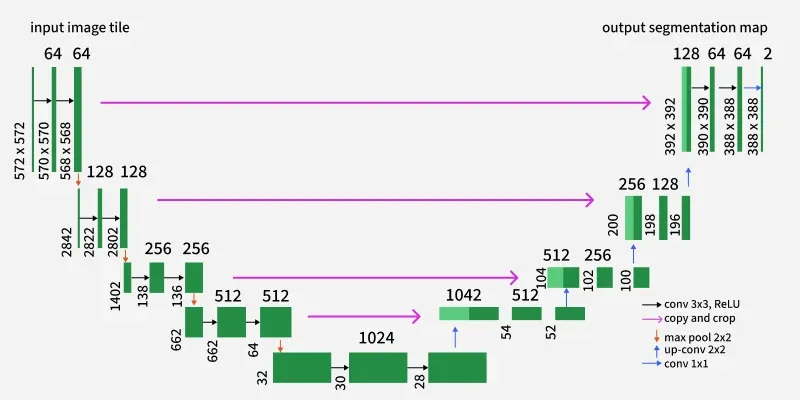
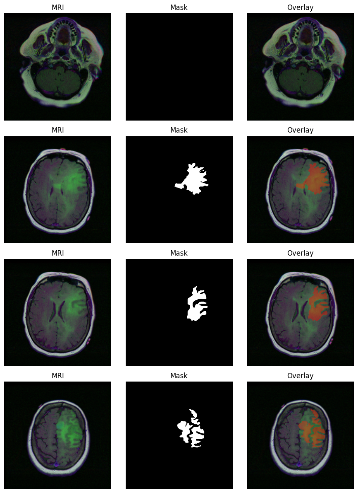
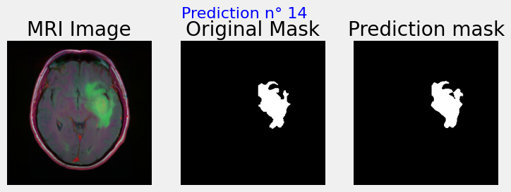

# Brain MRI Segmentation

Segmentation of **FLAIR** abnormalities in brain magnetic resonance (MRI) images.
The project locates the tumor region at pixel level in *lower-grade glioma* cases,
training a **U-Net** on manually annotated image/mask pairs.

Dataset: [LGG MRI Segmentation](https://www.kaggle.com/datasets/mateuszbuda/lgg-mri-segmentation/data)
(110 patients, **7858** image/mask pairs, TCIA / TCGA).

<p align="center">
  
</p>

---

## Dataset example

Each sample is a pair: the axial **FLAIR MRI slice** and its **manually annotated mask**
(the abnormality region). The overlay on the right shows the mask superimposed on the MRI.

<p align="center">
  
</p>

---

## Notebook summary

The notebook [`brain_mri_segmentation.ipynb`](brain_mri_segmentation.ipynb) covers the full
pipeline, from raw data to prediction:

| # | Section | Content |
|---|---------|---------|
| 1 | **The dataset** | Download of the LGG dataset via `kagglehub` |
| 2 | **Exploration & Preparation** | Pairing images/masks into a `DataFrame`, visualization (MRI + mask + overlay), train/val/test split and batch generators with data augmentation |
| 3 | **Metrics** | Dice coefficient, Dice loss and IoU (Jaccard); metrics robust to the tumor/background class imbalance |
| 4 | **Model** | **U-Net** encoder–decoder architecture with skip connections, sigmoid output `256×256×1` |
| 5 | **Training** | Training loop (70 epochs, batch 40, Adamax lr=0.001, Dice loss), `save_best_only` checkpoint to `unet.keras`, learning curves |
| 6 | **Load model** *(optional)* | Reload the saved `unet.keras` weights without retraining |
| 7 | **Evaluation** | Assessment on the hold-out test set |
| 8 | **Prediction** | Qualitative comparison: MRI / ground-truth mask / predicted mask |
| 9 | **Conclusions** | Summary of results and possible extensions |
| 10 | **References** | Dataset citations |

### Results (test set)

| Metric | Value |
|--------|-------|
| Loss (−Dice) | −0.909 |
| Accuracy | 0.998 |
| IoU | 0.835 |
| Dice | 0.909 |

---

## Prediction example

Qualitative comparison on the hold-out test set: the input **MRI**, the **ground-truth mask**
and the **mask predicted** by the U-Net.

<p align="center">
  
</p>

---

## Requirements

- Python 3.9+
- `tensorflow` / `keras`, `numpy`, `pandas`, `opencv-python`, `scikit-image`,
  `scikit-learn`, `matplotlib`, `seaborn`, `kagglehub`

```bash
pip install tensorflow numpy pandas opencv-python scikit-image scikit-learn matplotlib seaborn kagglehub
```

> ℹ️ **On Kaggle these requirements are optional**: the Kaggle notebook environment
> already ships with `tensorflow`/`keras`, `numpy`, `pandas`, `opencv-python`,
> `scikit-image`, `scikit-learn`, `matplotlib`, `seaborn` and `kagglehub` preinstalled,
> so you can run the notebook as-is without the `pip install` below. The list matters
> only when running the notebook **outside** Kaggle (e.g. locally).

> A **GPU** is strongly recommended for training. The notebook was built on Kaggle
> (data paths look like `/kaggle/input/...`); `kagglehub.dataset_download(...)`
> automatically downloads the dataset and returns the local path.

---

## How to run it

Open the notebook with Kaggle:

### A) "Save & Run All (Commit)" in background

On Kaggle you can run the whole notebook in the background without keeping the browser
open, and collect the produced `unet.keras` from the version's output.

1. Open the notebook on Kaggle and make sure the **GPU** accelerator is enabled
   (*Settings → Accelerator → GPU*).
2. Click **Save Version** (top-right).
3. Choose **Save & Run All (Commit)**: Kaggle runs the notebook from top to bottom
   in a fresh, headless session (you can close the tab, it keeps running).
4. When the run finishes, open the version and go to the **Output** tab: the
   `unet.keras` file saved by the `save_best_only` checkpoint (Section 5) is there,
   ready to download.

> 💡 A committed version runs **all cells in order**, so keep Section 6 (*Load model*)
> commented out, otherwise it would try to reload weights that don't exist yet during
> a from-scratch run.

> ⚠️ Kaggle enforces a max session time (currently ~12h with GPU). Training (70 epochs)
> fits comfortably, but keep an eye on the limit if you increase epochs or batch size.

At the end you get the `unet.keras` weights file saved locally.
⚠️ Training (70 epochs) can take a long time without a GPU.

### B) From scratch — training the model

Run **all cells in order**, top to bottom:

1. Library imports
2. Global settings (splits and seeds)
3. Section 1: dataset download
4. Section 2: data preparation and generators
5. Section 3: metrics
6. Section 4: U-Net definition
7. Section 5: **training** (produces the `unet.keras` file)
8. Sections 7–8: evaluation and prediction

At the end you get the `unet.keras` weights file saved locally.
⚠️ Training (70 epochs) can take a long time without a GPU.


### C) With ready-made weights — without retraining

If you already have the `unet.keras` file, you can **skip training** and run
**only** these cells, in this order:

1. Library imports
2. Global settings (splits and seeds)
3. Section 1: dataset download
4. Section 2.1: locate the masks
5. Section 2.2: build the `DataFrame`
6. Section 2.5: train / val / test split
7. Section 3: metrics (needed to recompile the model)
8. Section 6: **Load model**: remove the triple quotes `"""` that comment out the cell,
   set `model_path` to the path of your `unet.keras` and run it
9. Section 7: evaluation
10. Section 8: prediction

Example of loading weights (Section 6):

```python
model_path = "path/to/your/unet.keras"

model = keras.models.load_model(model_path, compile=False)
model.compile(
    optimizer="adam",
    loss=dice_loss,
    metrics=["accuracy", iou_coef, dice_coef],
)
```

> Note: the custom metrics/loss (`dice_coef`, `dice_loss`, `iou_coef`) must be defined
> in the session (Section 3) **before** recompiling the loaded model.

---

## Project structure

```
brain-mri-segmentation/
├── brain_mri_segmentation.ipynb   # full notebook
├── assets/
│   └── img/
│       ├── u_net.png              # U-Net architecture diagram
│       ├── data_example.png       # Dataset example (MRI / mask / overlay)
│       └── pred_example.png       # Prediction example (MRI / GT / prediction)
└── README.md
```

---

## References

- Buda M., Saha A., Mazurowski M. A. *"Association of genomic subtypes of lower-grade gliomas with
  shape features automatically extracted by a deep learning algorithm."* Computers in Biology and Medicine, 2019.
- Mazurowski M. A., Clark K., Czarnek N. M., et al. *"Radiogenomics of lower-grade glioma..."*
  Journal of Neuro-Oncology, 2017.
